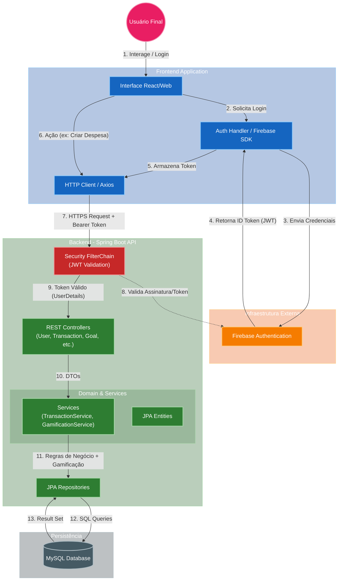

# 🦊 FinQuest - Educação Financeira Gamificada

<div align="center">

**Transforme sua relação com o dinheiro através da gamificação**

[](https://openjdk.org/)
[](https://spring.io/projects/spring-boot)
[](https://react.dev/)
[](https://www.typescriptlang.org/)
[](https://www.mysql.com/)
[](https://firebase.google.com/)

[Funcionalidades](#-funcionalidades) • [Tecnologias](#-tecnologias)  • [Arquitetura](#-arquitetura)

</div>

---

## 📖 Sobre o Projeto

**FinQuest** é uma plataforma inovadora de educação financeira que utiliza técnicas de gamificação para tornar o aprendizado sobre finanças pessoais mais engajador e eficaz para jovens adultos. Através de missões, conquistas, níveis e um sistema de pontos (FinPoints), os usuários aprendem conceitos financeiros enquanto se divertem.

### 🎯 Problema que Resolve

A falta de educação financeira entre jovens brasileiros leva a:
- Endividamento precoce
- Dificuldade em poupar e investir
- Desconhecimento sobre planejamento financeiro
- Baixa taxa de poupança nacional

### 💡 Nossa Solução

FinQuest combina:
- ✅ **Educação**: Cursos estruturados e lições interativas
- ✅ **Gamificação**: Missões, conquistas e sistema de níveis
- ✅ **Prática**: Simuladores e ferramentas de planejamento
- ✅ **Motivação**: Recompensas por progresso e aprendizado

---

## ✨ Funcionalidades

### 🎓 Sistema de Aprendizado

#### **Cursos e Lições Interativas**
- 📚 Trilhas de conhecimento estruturadas em cursos temáticos
- 📝 Lições de 5-10 minutos com conteúdo didático
- ❓ Quizzes interativos para fixação do aprendizado
- 🎯 Sistema de progresso visual (0-100%)
- 🏆 Certificados ao completar trilhas

#### **Tópicos Abordados**
- Orçamento pessoal e familiar
- Investimentos (Renda fixa, variável, fundos)
- Controle de dívidas e crédito
- Planejamento de metas financeiras
- Educação sobre juros compostos

### 🎮 Sistema de Gamificação

#### **FinPoints - Sistema de Pontos**
- 💰 Ganhe FinPoints completando lições, missões e metas
- 📈 Evolua de nível baseado nos seus pontos acumulados
- 🔢 Sistema de progressão exponencial (nível 1 → 100 XP, nível 2 → 130 XP...)

#### **Missões**
- 🎯 Missões diárias e semanais
- 📊 4 categorias: Aprendizado, Orçamento, Metas e Social
- 🎁 Recompensas em FinPoints
- 📈 Acompanhamento de progresso (ex: "Complete 3 lições - 2/3")

#### **Conquistas e Badges**
- 🏅 Desbloqueie badges ao atingir níveis específicos
- 🎖️ Conquistas especiais por marcos importantes
- 👤 Perfil personalizado com avatar e emblemas

### 💰 Ferramentas Financeiras

#### **Acompanhamento Financeiro**
- 📊 Registre receitas e despesas
- 🏷️ Categorização automática
- 📈 Gráficos de distribuição de gastos
- 💵 Cálculo de saldo e taxa de poupança
- 📅 Filtros por período (mês, ano)

**Categorias Disponíveis:**
- **Receitas**: Salário, Freelance, Investimentos, Vendas, Presente, Outros Ganhos
- **Despesas**: Alimentação, Moradia, Transporte, Saúde, Educação, Entretenimento, Roupas, Serviços, Outros Gastos

#### **Planejamento Orçamentário**
- 📅 Crie orçamentos mensais
- 💡 Sugestões baseadas no histórico
- 🎯 Compare planejado vs. realizado
- 📊 Visualização de aderência ao orçamento

#### **Metas Financeiras**
- 🎯 Crie metas personalizadas (ex: "Comprar PS5 - R$ 4.500")
- 📈 Acompanhe progresso em tempo real
- 💰 Registre depósitos incrementais
- 🏆 Ganhe recompensas ao atingir 25%, 50%, 75% e 100%
- ✅ Status automático (Em Progresso, Concluída, Cancelada)

#### **Simulador de Investimentos**
- 📊 Simule diferentes estratégias de investimento
- ⏱️ Visualize efeito dos juros compostos
- 💹 Compare cenários (conservador vs. arrojado)
- 📈 Gráficos interativos de evolução patrimonial

### 👨‍💼 Painel Administrativo

- 📊 Dashboard com estatísticas da plataforma
- 👥 Gerenciamento de usuários
- 📈 Métricas de engajamento
- 🎯 Acompanhamento de missões completadas
- 🏆 Estatísticas de níveis e conquistas

---

## 🛠 Tecnologias

### Backend

| Tecnologia | Versão | Descrição |
|-----------|--------|-----------|
| **Java** | 21 | Linguagem de programação principal |
| **Spring Boot** | 3.5.6 | Framework para aplicações Java |
| **Spring Security** | 3.x | Autenticação e autorização |
| **Spring Data JPA** | 3.x | Persistência de dados |
| **Hibernate** | 6.x | ORM (Object-Relational Mapping) |
| **MySQL** | 8.0+ | Banco de dados relacional |
| **Firebase Admin SDK** | 9.7.0 | Autenticação via Firebase |
| **Maven** | 3.9+ | Gerenciador de dependências |
| **Docker** | - | Containerização |

## 🏗 Arquitetura

### Visão Geral



### Padrões de Projeto Utilizados

#### 🎯 **MVC (Model-View-Controller)**
Arquitetura padrão do Spring Boot separando responsabilidades

#### 🔄 **Repository Pattern**
Abstração de acesso a dados com Spring Data JPA

#### 🎨 **DTO Pattern (Data Transfer Objects)**
Transferência de dados entre camadas usando Java Records
```java
public record TransactionDTO(
    String id,
    String type,
    BigDecimal amount,
    String description,
    String category,
    String date,
    String notes
) {}
```

#### 🔒 **Dependency Injection**
Injeção de dependências gerenciada pelo Spring

#### 🏭 **Service Layer Pattern**
Camada intermediária entre controllers e repositories

---

## 📦 Recursos e Documentos

Abaixo estão os materiais complementares para avaliação do projeto:

[](./docs/Documentacao_Tecnica_API_FinQuest.pdf)
[](https://drive.google.com/file/d/1eiGSFRzTIaQocQIsbClvT7hl1HeUs4Lx/view?usp=sharing)

---

## 👥 Equipe

| Nome Completo | Prontuário |
| :--- | :---: |
| **Luis Henrique Aguiar** | AQ302234X |
| **Cristiano Rodrigues de Oliveira** | AQ3022641 |
| **Érika Santana Alves** | AQ3022722 |
| **Matheus Mantovani** | AQ3022927 |
| **João Andolpho** | AQ3022501 |
---

<div align="center"> <sub>FinQuest © 2025 - Educação Financeira para Todos</sub> </div>
